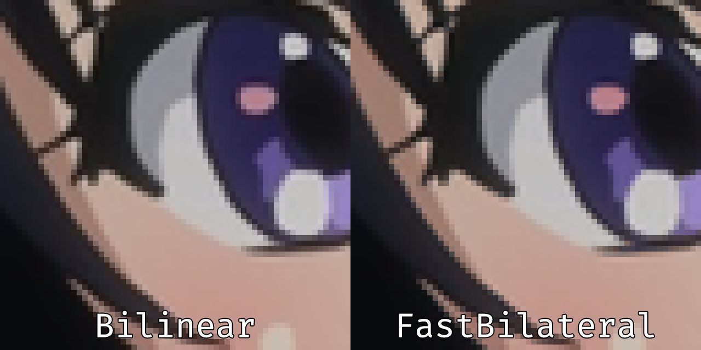

# GLSL Joint Bilateral

## Overview
This is a simple implementation of joint bilateral chroma upsampling. It uses the luma plane as a guide to achieve sharper edges without introducing any ringing.

The repo contains 2 distinct shaders:
- `JointBilateral.glsl`: This is the ["classic version"](https://en.wikipedia.org/wiki/Bilateral_filter) of the shader with gaussian functions.
- `FastBilateral.glsl`: This uses bilinear interpolation in the spatial plane, which makes it pretty fast.

## Instructions
Add something like this to your mpv config:
```
vo=gpu-next
# For the classic version:
glsl-shader="path/to/shader/JointBilateral.glsl"
# For the simpler/faster version:
glsl-shader="path/to/shader/FastBilateral.glsl"
```
gpu-next is required due to the usage of tunable parameters.

## Parameters
You can set the following parameters:
- `distance_coeff`: Controls the shape of the spatial Gaussian filter. Higher values decrease the contribution of pixels more distant to the centre. Accepts floats higher than `0.0`, defaults to `2.0`.
- `intensity_coeff`: Controls the shape of the Gaussian filter used for intensity-distance weighting. Higher values decrease the contribution of pixels with distant luminosities. Accepts floats higher than `0.0`, defaults to `128.0`.

On `vo=gpu-next`, you can set these settings with `--glsl-shader-opts=param1=value1,param2=value2,...`.

## Example
