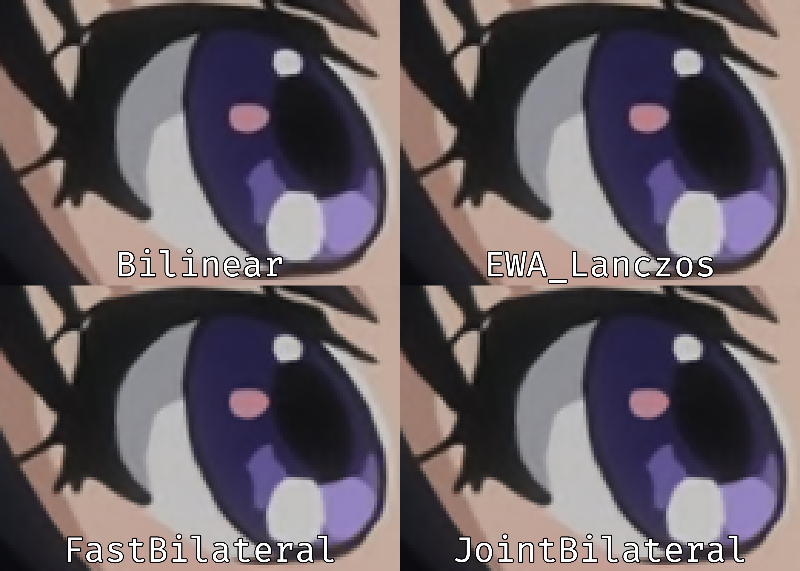

# GLSL Joint Bilateral

## Overview
This is a simple implementation of joint bilateral chroma upsampling. It uses the luma plane as a guide to achieve sharper edges without introducing any ringing.

The repo contains 2 distinct shaders:
- `JointBilateral.glsl`: ["Classic version"](https://en.wikipedia.org/wiki/Bilateral_filter) of what is known as "joint-bilateral". This uses gaussian functions to weight spatial and intensity distances. To understand how this works feel free to read ["this paper"](https://johanneskopf.de/publications/jbu/paper/FinalPaper_0185.pdf).
- `FastBilateral.glsl`: This is a simplified version of the shader.

## Instructions
Add something like this to your mpv config:
```
vo=gpu-next
glsl-shader="path/to/shader/JointBilateral.glsl"
```
gpu-next is required due to the usage of tunable parameters.

## Parameters
You can set the following parameters:
- `distance_coeff`: Controls the shape of the spatial Gaussian filter. Higher values decrease the contribution of pixels more distant to the centre.
- `intensity_coeff`: Controls the shape of the Gaussian filter used for intensity-distance weighting. Higher values decrease the contribution of pixels with distant luminosities.

On `vo=gpu-next`, you can set these settings with `--glsl-shader-opts=param1=value1,param2=value2,...`.

The shaders have very aggressive defaults, which may not work well on all content. If you find the output too harsh, try reducing the coefficients.

## Example

